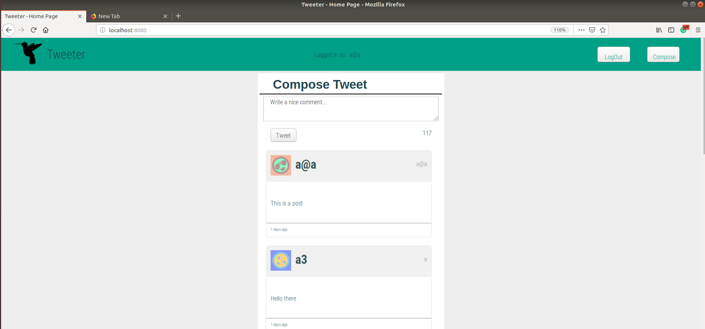
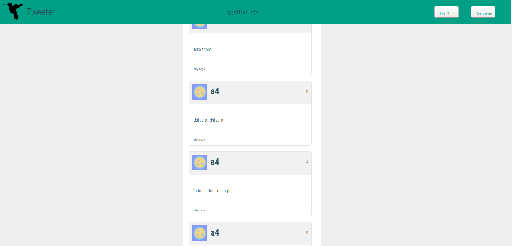

# Tweeter Project

Tweeter is a simple, single-page Twitter clone.

## Final Product (screenshots)

 

## Getting Started

- Install all dependencies (using the `npm install` command).
- This app using Mongo db with hard coded attributes. 
- Run the development web server using the `node express_server.js` command.

## Dependencies

- Express
- Node 5.10.x or above
- body-parser
- cookie-session
- express
- md5
- mongodb
- morgan

## Requirements

### Functional Requirements

-    Primarily a client-side Single Page App (SPA)
-    The client-side app communicates with a server via AJAX
-    Tweets are persisted to MongoDB and survive server restart

### Display Requirements

-    Navigation Bar:
      1.  is fixed to the top
      2.  has padding on both sides
      3.  contains Compose button

-    Compose Tweet box:
      1.  is displayed above the list of tweets
      2.  is hidden on page load
      3.  contains a form for submitting tweets, which itself contains:
            a textarea for new tweet content
            a left-aligned button for submitting new tweets
      4.  contains a Character Counter, right-aligned, which by default shows 140

-    List of Tweets:
      Displays tweets in reverse-chronological order (that is, by creation time descending)

-    Individual Tweets:
        1. have a header, which contains the user's:
            avatar, on the left
            name, on the left and after the avatar
            handle, on the right
        2. have a body, which contains the tweet text
        3. have a footer, which displays:
            how long ago the tweet was created, on the left
            "Flag", "Re-tweet" and "Like" icons upon hovering over the tweet, on the right

### Behaviour
#### Navigation Bar

-    When a user clicks the Compose button in the Navigation Bar:
      1.  if the Compose Tweet box is currently hidden, then it is shown, and the textarea inside it is auto-focused
      2.  if the Compose Tweet box is currently showing, then it is hidden
      3.  in either case, transitions between 'shown' and 'hidden' states should be animated

#### Character Counter

-    When a user types into the Compose Tweet textarea, the Character Counter is updated to show how many characters a user may still type (subtracting the number of characters they've typed from the maximum allowable character count of 140)

-    The Character Counter turns red (or similar) when more than 140 characters have been typed into the Compose Tweet textarea, and it shows how many characters over the 140 limit have been typed (using a negative number)

#### Compose Tweet

-    When a user submits an invalid tweet (the tweet textarea is empty or contains more than 140 characters), an appropriate error message is displayed

-    When a user submits a valid tweet, the list of tweets is refreshed (displaying the new tweet), the Compose Tweet textarea is cleared, and the Character Counter is reset (to 140)

## TODO
### docs
- update README.md with strech funcionality
### server side
- implement log out funcionality and add '/logout POST' endpoint
- use hashing for safer password handling
- use other than db _id as a session id (something which can expire)
- handle if user already logged in when requesting the page (sending header - param?, hidden field?, automoatic login ajax on page load?)
### client side
- use ajax for logout (after it is implemented on server side)
- make the header and the new-tweet error field (great, khmmm no the other - one..) responsive again
- get rid of unnessecery scrolls (when on small screen size)

